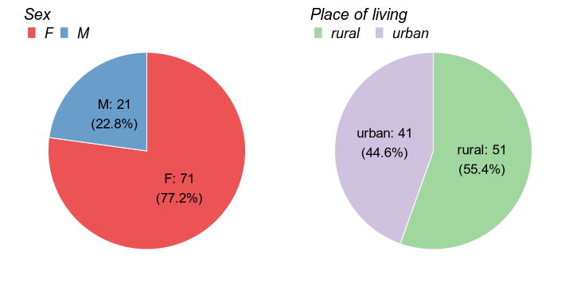
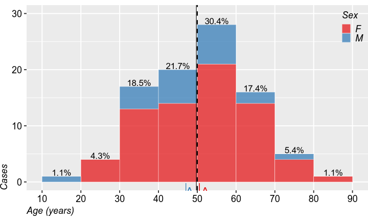
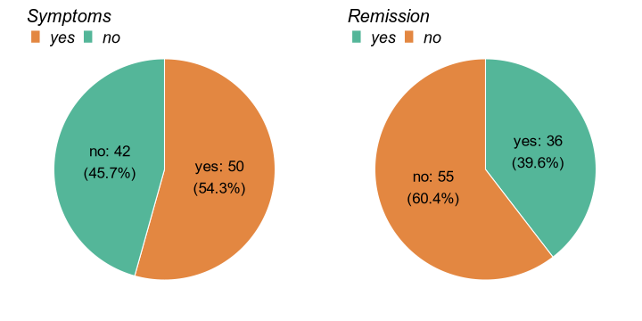
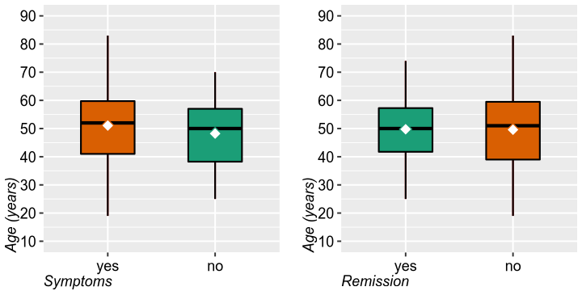

# General part

https://rpubs.com/alex_istrate/

# Special part

## Introduction

### Objectives

## Methods

### Statistical analysis of the data

To describe the quantitative variables, we used histograms and we calculated the arithmetic means ±standard deviation (SD) [with 95% confidence interval (CI)], as well as the extreme and median values. For the qualitative variables, we used pie or bar charts and calculated the absolute and percentual frequencies of the formed categories.

To study the relationships between quantitative and qualitative variables, we used the T or Mann-Whitney (MW) tests. We presented the p values generated by these tests as well as the means ±SD of the groups. We graphically presented the results in the form of box plots. To describe the relationships between the qualitative variables we used  Fisher test and Odds-Ratio (OR) with 95% CI. We graphically presented the results in the form of pie or bar charts.

We used Microsoft Excel for database management. For all statistical analyzes and subsequent graphs we used R 3.6.2 [1]. We considered p <0.05 to be statistically significant and p <0.10 to show only a tendency towards statistical significance.

## Results

### Demographics

A total of 92 patients were selected, most of whom were women (77%). Almost half of the patients (45%) were living in a rural residence. Age was normally distributed, with values ranging from 19 to 83 years old and an average age of 49.76 ±12.9 years old.

### Active disease

Over half of the patients (54%) showed symptoms at onset and 40% were in remission at the time of admission.

Figure  4: Age distribution, at admission, by Symptoms at onset and Remission at time of admission (◆ mean, — median)).

Presense of symptoms at onset were not significantly correlated to patients gender (OR=0.86, p=0.808), rural place of living (OR=1.05, p>0.999) or age (T test: p=0.296).

Presense of symptoms at onset were not significantly correlated to patients gender (OR=1.41, p=0.614), rural place of living (OR=1.41, p>0.519) or age (T test: p=0.952).

### Symptoms

Most patients complained of astehnia (21.7%), abdominal pain (18.5%) and / or fatigue (14.1%). With the exception of fatigue, which was only reported by women, no other symptom showed any statisticaly significant sex preference (OR=13.24, p=0.022).

# References

1. R Core Team (2020). R: A language and environment for statistical computing. R Foundation for Statistical Computing, Vienna, Austria. URL https://www.R-project.org/.

